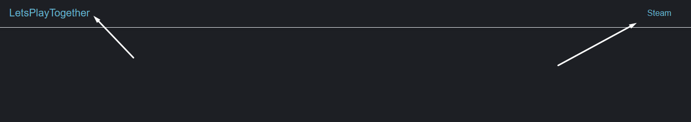
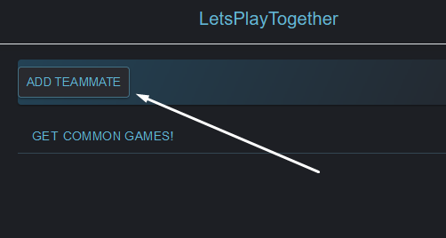
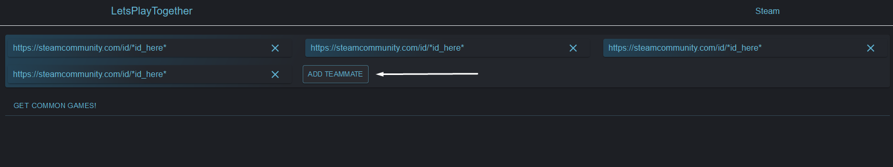
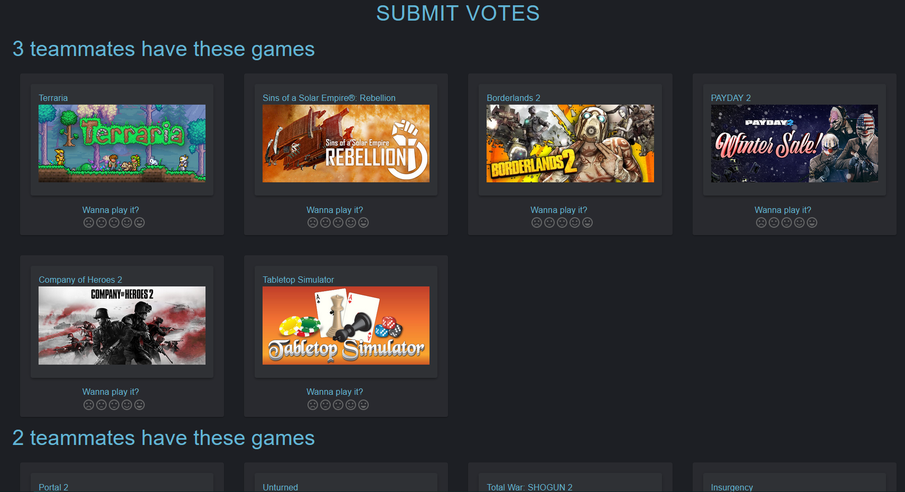
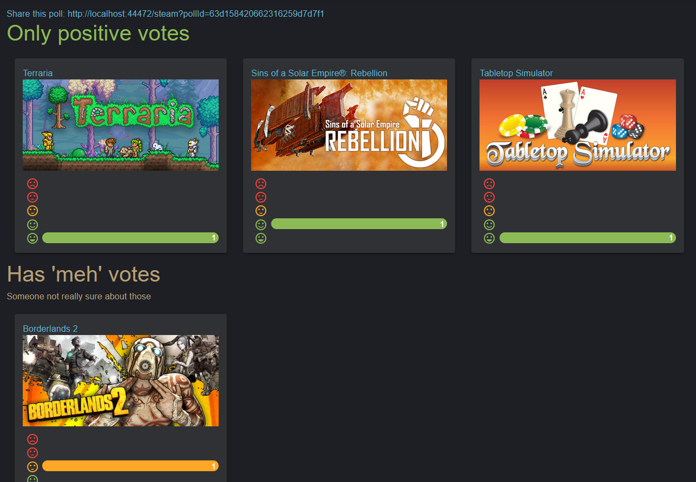

<h1>LetsPlayTogether</h1>

Find common games in steam to play with your friends!

<h2>How to use it?</h2>
After running this app head to url it provides. Head next to one of the links



After that click on ```Add teammate``` and paste your friends' Steam profile links




After all urls are paste press that ```GET COMMON GAMES``` button.
Here you go. That's the poll that you can share with your friends and vote for your beloved common games



After voting submit your votes and it will head to poll results.


